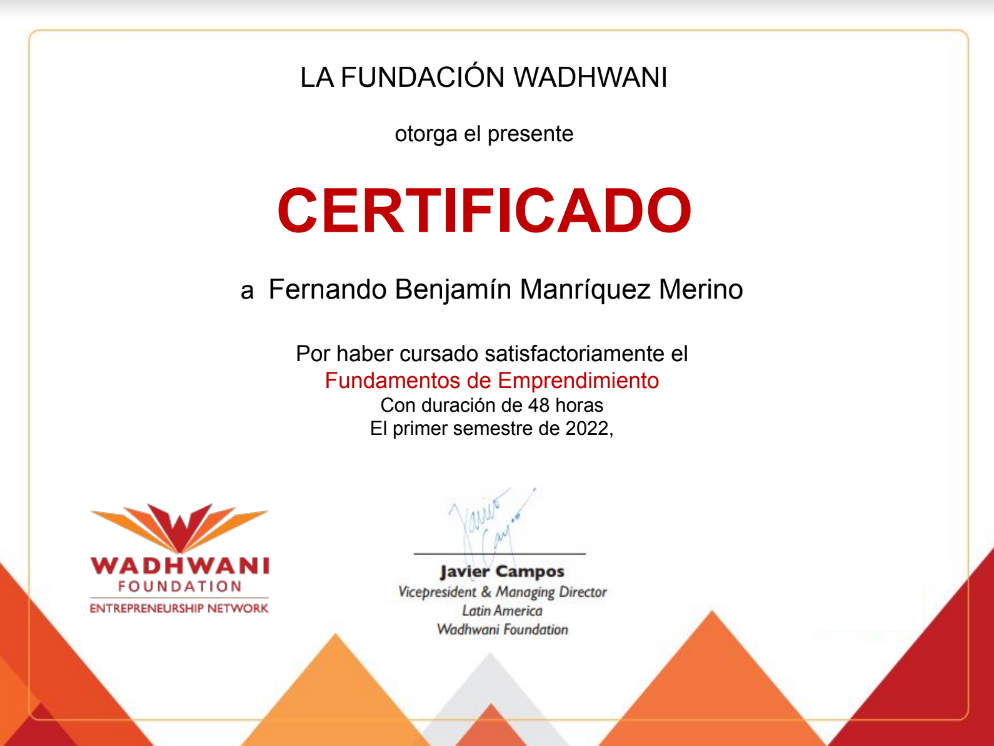
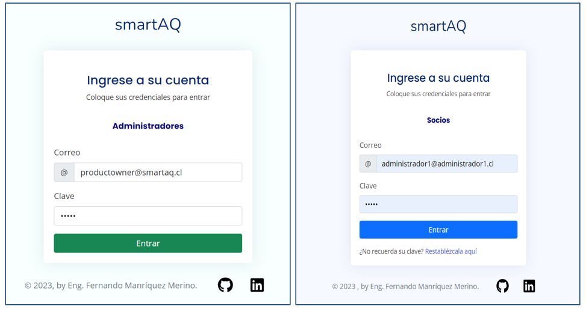
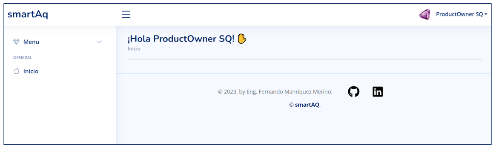
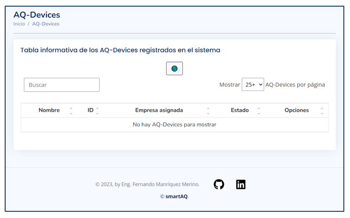
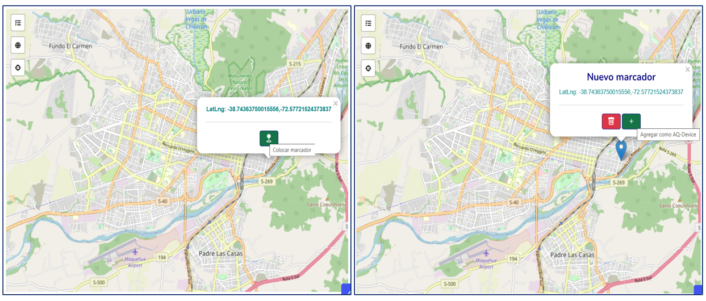
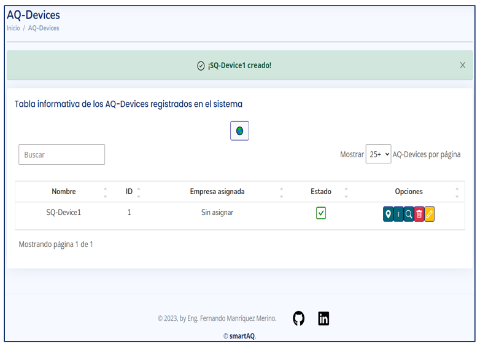
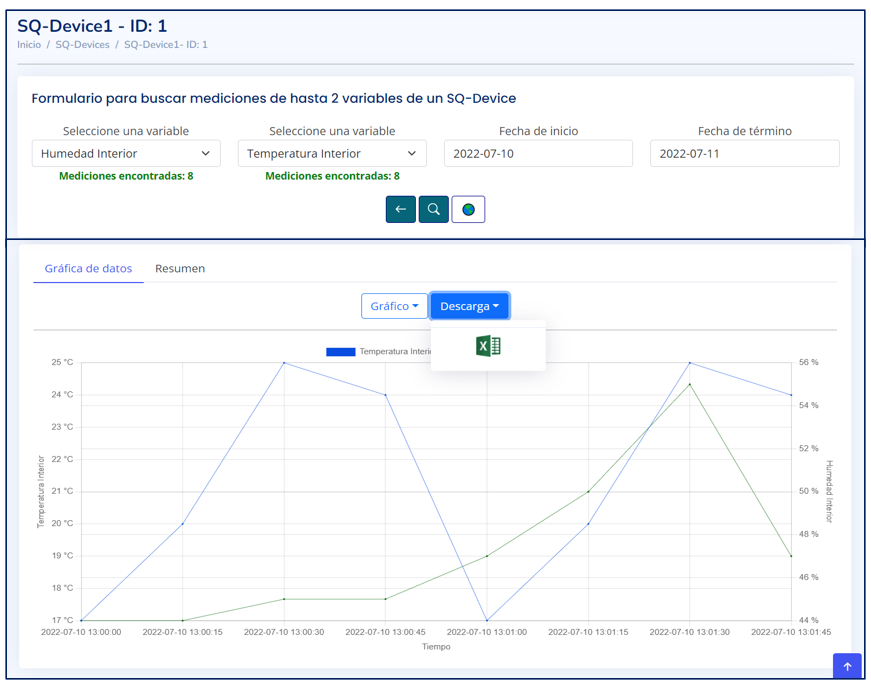
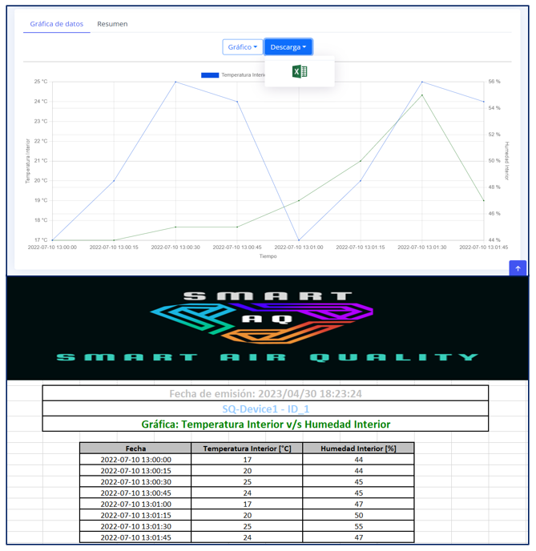

# Proyecto: ```smartAQ```

Durante la cursada de la asignatura ```Taller empresarial de innovación y emprendimiento```, se nos asignó un proyecto que consistió en diseñar y desarrollar un emprendimiento con alto potencial. Decidimos contribuir al cuidado de la salud de las personas mediante la construcción de una aplicación gratuita para aquellos que se registraran en la plataforma web, proporcionándoles información sobre el material particulado y otras mediciones de interés, además de ofrecer otros beneficios relacionados con el cuidado del medio ambiente. A lo largo del curso, se elaboraron informes y presentaciones relacionados con el producto. Al llegar a la fase final del curso, se nos solicitó que presentáramos un Producto Mínimo Viable (MVP). Como programador del proyecto, desarrollé una aplicación que cumplía con el cometido del emprendimiento: proporcionar información gratuita a los usuarios que ingresaran a la aplicación web, junto con otros beneficios.


Si algún reclutador está interesado en obtener más detalles, puede ponerse en contacto conmigo a través de mi correo electrónico: manriquezfernando.ns@gmail.com

### Stack de tecnologías.
<p align="center">
  
</p>
Para la creación de la plataforma web, se utilizaron principalmente frameworks de Java como SpringMVC, para separar la lógica y los modelos de la vista e Hibernate para conectarse a la base de datos.  

Cabe mencionar que los casos de uso totales de la aplicacion se mantienen en reserva. Además, es importante destacar que la plataforma web es un prototipo, no una versión comercial ni patentada, y que su versión ha sido actualizada en este año 2023.  

Antes de presentar las imágenes del proyecto, es importante destacar que hemos obtenido una ```calificación máxima de 7.0``` en relación a nuestro producto mínimo viable. En este sentido, se nos ha entregado un certificado que valida la calidad del trabajo. A continuación, se muestra el certificado correspondiente.

<p align="center">
  
</p>

### ```Inicios de sesión``` de la aplicación

A continuación, se presentan las imágenes correspondientes a los inicios de sesiones para determinados tipos de usuarios.
<p align="center">
  
</p>

### ```Home page``` de la aplicación

<p align="center">
  
</p>

### ```Ver AQ-Device```
El siguiente caso de uso permite a un tipo de usuario en particular acceder a la información de la cantidad total de dispositivos almacenados en la base de datos.
<p align="center">
  
</p>

### ```Agregar AQ-Device```
Este caso de uso permite a un tipo específico de usuario agregar dispositivos mediante un mapa interactivo que incluye numerosas funcionalidades. Además, el mapa actualiza la coordenada del marcador a medida que el usuario lo arrastra a una nueva ubicación. 

<p align="center">
  
</p>

### ```Notificación de creación de AQ-Device```
Después de crear un nuevo AQ-Device, el sistema envía una notificación para informar al usuario acerca de la creación y lo redirige automáticamente a la vista que muestra los dispositivos existentes en el sistema. 

<p align="center">
  
</p>

### ```Ver mediciones```
Un tipo específico de usuario tendrá la capacidad de buscar mediciones de un dispositivo en particular y, además, se le permitirá exportar estas mediciones a un documento XLSX. 

<p align="center">
  
</p>
<p align="center">
  
</p>