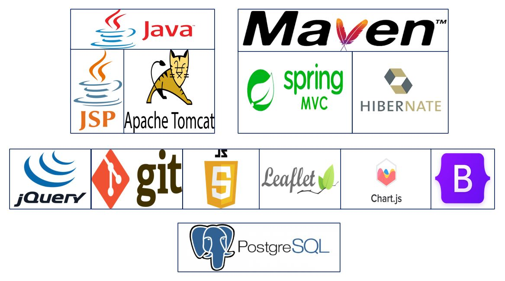

# Proyecto: ```smartAQ```

Durante la cursada de la asignatura de ```Taller empresarial de innovación y emprendimiento```, se nos asignó el proyecto de desarrollar un posible emprendimiento con gran potencial. Durante el transcurso del curso, se elaboraron informes y presentaciones relacionados con el producto. Al llegar a la etapa final del curso, se nos pidió que presentáramos un producto mínimo viable, y como programador del proyecto, desarrollé una aplicación que cumplía con el objetivo del emprendimiento: proporcionar información gratuita a los usuarios que visitaran la aplicación web y otros beneficios.

Para la creación de la plataforma web, se ocuparon principalmente frameworks de Java como SpringMVC para separar la lógica y los modelos de la vista, e Hibernate para conectarnos a la base de datos.

Si algún reclutador está interesado en obtener más detalles, puede ponerse en contacto conmigo a través de mi correo electrónico: manriquezfernando.ns@gmail.com

### Stack de tecnologías.
<p align="center">
  
</p>

Cabe mencionar que los casos de uso totales de la aplicacion se mantienen en reserva. Además, es importante destacar que la plataforma web es un prototipo, no una versión comercial ni 
patentada, y que su versión ha sido actualizada en este año 2023.


