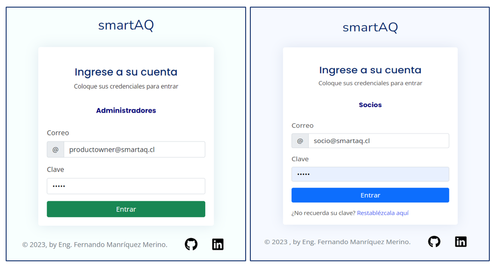
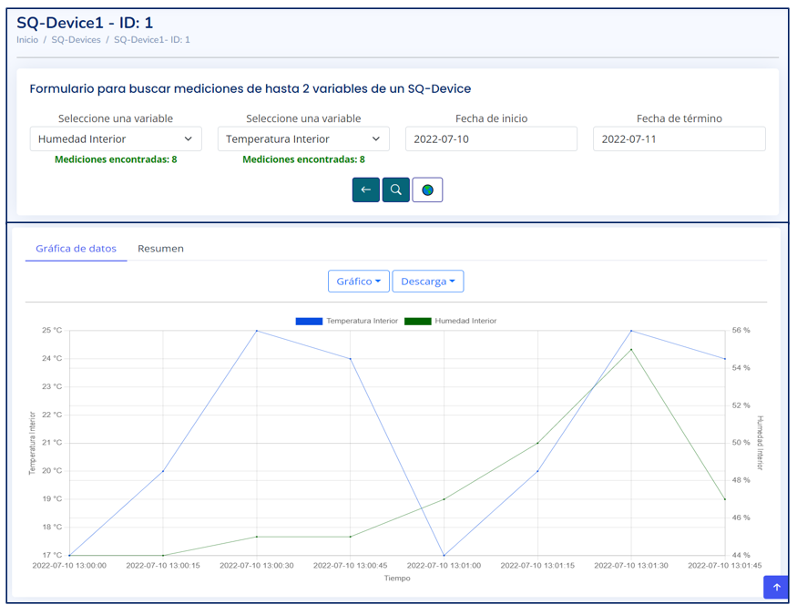
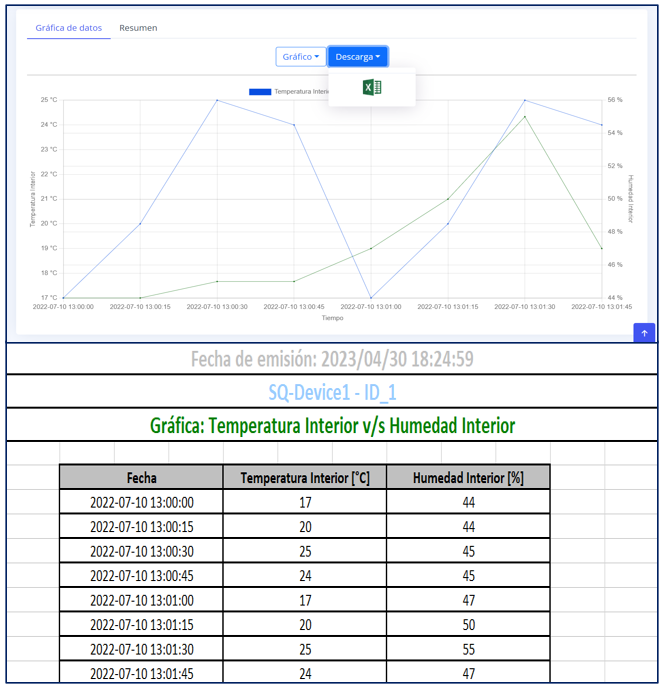

# Proyecto: ```smartAQ```

Durante la cursada de la asignatura de ```Taller empresarial de innovación y emprendimiento```, se nos asignó el proyecto de desarrollar un posible emprendimiento con gran potencial. Durante el transcurso del curso, se elaboraron informes y presentaciones relacionados con el producto. Al llegar a la etapa final del curso, se nos pidió que presentáramos un producto mínimo viable, y como programador del proyecto, desarrollé una aplicación que cumplía con el objetivo del emprendimiento: proporcionar información gratuita a los usuarios que visitaran la aplicación web y otros beneficios.

Para la creación de la plataforma web, se ocuparon principalmente frameworks de Java como SpringMVC para separar la lógica y los modelos de la vista, e Hibernate para conectarnos a la base de datos.

Si algún reclutador está interesado en obtener más detalles, puede ponerse en contacto conmigo a través de mi correo electrónico: manriquezfernando.ns@gmail.com

### Stack de tecnologías.
<p align="center">
  
</p>

Cabe mencionar que los casos de uso totales de la aplicacion se mantienen en reserva. Además, es importante destacar que la plataforma web es un prototipo, no una versión comercial ni patentada, y que su versión ha sido actualizada en este año 2023.  

Antes de presentar las imágenes del proyecto, es importante destacar que hemos obtenido una ```calificación máxima de 7.0``` en relación a nuestro producto mínimo viable. En este sentido, se nos ha entregado un certificado que valida la calidad del trabajo. A continuación, se muestra el certificado correspondiente.

<p align="center">
  
</p>

### ```Inicios de sesión``` de la aplicación

A continuación, se presentan las imágenes correspondientes a los inicios de sesiones para determinados tipos de Usuario.
<p align="center">
  
</p>

### ```Home page``` de la aplicación

<p align="center">
  
</p>

### ```Ver AQ-Device```
El siguiente caso de uso permite a un tipo de usuario en particular acceder a la información de la cantidad total de dispositivos almacenados en la base de datos.
<p align="center">
  
</p>

### ```Agregar AQ-Device```
Este caso de uso permite a un tipo específico de usuario agregar dispositivos mediante un mapa interactivo que incluye numerosas funcionalidades. Además, el mapa actualiza la coordenada del marcador a medida que el usuario lo arrastra a una nueva ubicación. 

<p align="center">
  
</p>

### ```Notificación de creación de AQ-Device```
Después de crear un nuevo AQ-Device, el sistema envía una notificación para informar al usuario acerca de la creación y lo redirige automáticamente a la vista que muestra los dispositivos existentes en el sistema. 

<p align="center">
  
</p>

### ```Ver mediciones```
Un tipo específico de usuario tendrá la capacidad de buscar mediciones de un dispositivo en particular y, además, se le permitirá exportar estas mediciones a un documento XLSX. 

<p align="center">
  
</p>
<p align="center">
  
</p>